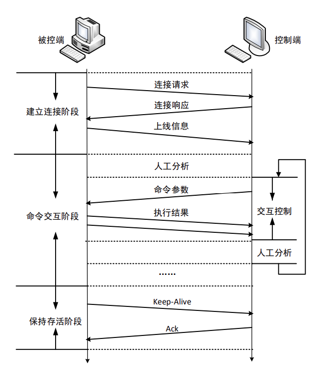
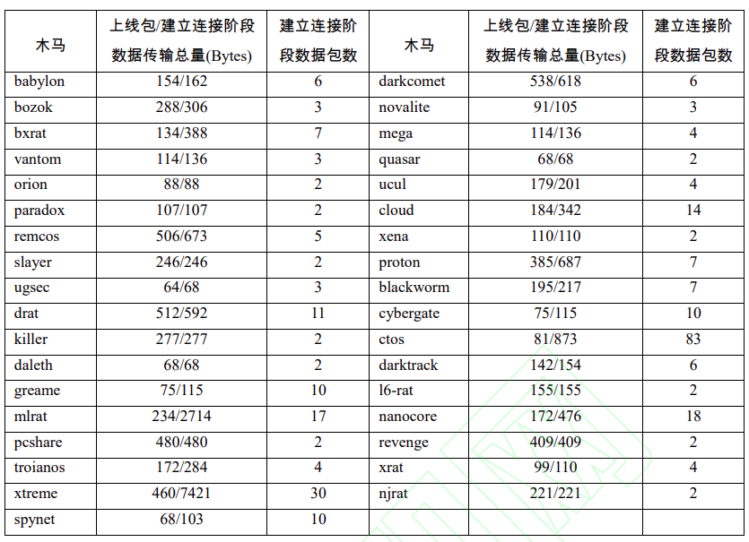
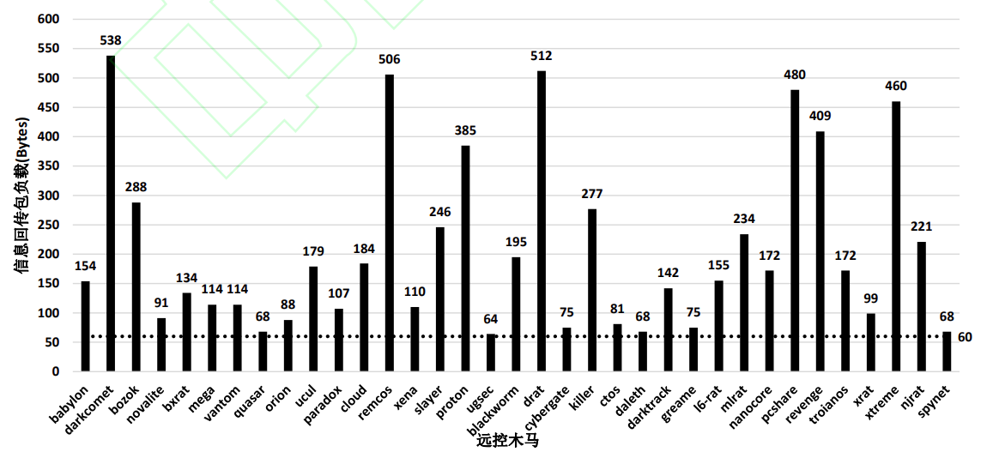
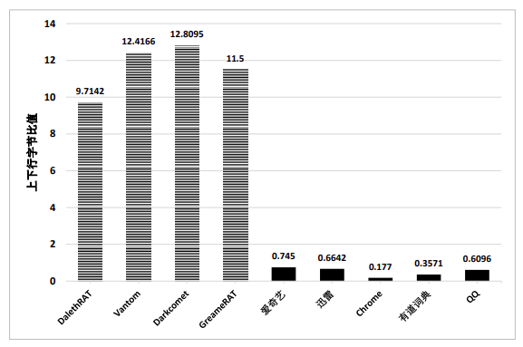
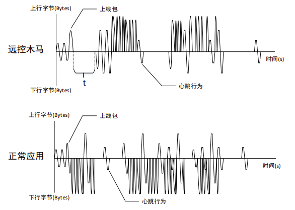
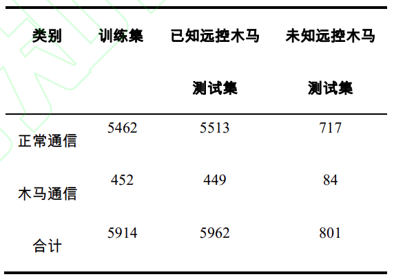
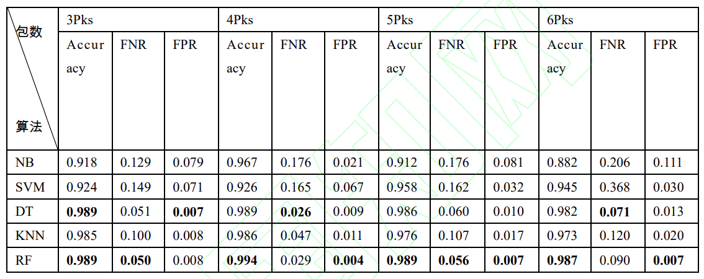
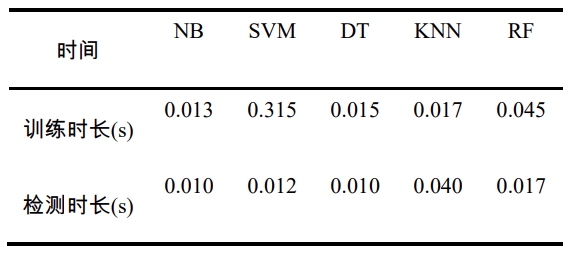

# 摘要

现阶段基于网络的远控木马检测方法大多对数据流的完整性有较高的要求，其检测存在一定程度的滞后。

该文在分析远控木马通信会话建立后初期流量的序列特性的基础上，提出了一种基于序列分析的远控木马早期检测方法。该方法以远控木马被控端和控制端交互中第一条 TCP 流为分析对象，重点关注流中由内部主机向外部网络发送且数据包传输层负载大于α字节的第一个数据包（上线包）及其后续数个数据包，从中提取包含传输负载大小序列、传输字节数和时间间隔在内的三维特征并运用机器学习算法构建了高效的早期检测模型。

该方法具备快速检测远控木马的能力，其通过远控木马会话建立后初期的少量数据包即可高准确率地检测出远控木马流量。

# 引言

为应对远控木马所引发的安全威胁，近年来国内外研究者提出了一系列远控木马检测方法。基于网络流量的检测方法是现阶段远控木马检测方法的主流，但是所提方法中大多运用的是从整个流中提取的统计特征，对木马通信流的完整性要求较高，致使可能出现在检测到远控木马流量的同时，被控主机已然执行部分攻击指令而已经出现了隐私信息泄露的情况。因此，为实现对远控木马的有效防御，对检测方法的检测及时性提出了越来越高的要求。

该文分析了远控木马会话建立后初期的网络流量行为，发现其控制端和被控端通常会在该时间段中出现不涉及人为操作而自动进行的、较为固定的数据包交互行为，且该行为与正常应用同时期的流量存在明显的序列差异。

基于上述分析结果，该文提出了一种基于序列分析的远控木马早期检测方法。该方法针对远控木马会话建立后初期流量中“上线包”及其后少量数据包所提取的包负载大小序列、包时间间隔以及包负载上传下载比三个特征，运用机器学习算法建立木马检测模型实现对远控木马的早期检测。

该文的主要贡献如下：

- 发现远控木马和正常软件各自通信会话建立后连接初期的流量在数据包负载大小、数据包时间间隔等方面存在明显区别，并进一步分析了远控木马通信会话建立后流量中第一次出现、且具有较大负载的“上线包”及其之后的数个数据包所具有的特性。
- 基于远控木马和正常软件在会话建立初期通信流量的差别，提出了一种基于序列分析的远控木马检测方法。
- 搭建模拟环境对所提出的远控木马检测方法进行了实验测试，并探索了“上线包”后不同的数据包数量对于所提方法检测结果的影响。

# 相关工作

## 基于主机的检测方法

- 通过将程序运行中的 API 调用转化为灰度图并运用图像识别相关技术来检测木马。
- 通过收集恶意程序在沙箱中运行的早期行为来进行恶意程序判别。
- 基于 `n-gram` 的关联分析法提出了一种木马程序的检测模型。

基于主机的检测方法需要将检测系统部署在主机上，除了占用一定主机资源之外，还需要涉及对系统的底层操作，可能对主机的稳定性造成一定影响。并且随着隐蔽技术在远控木马中的应用及发展，基于主机的检测难度逐渐增加。

## 基于网络的检测方法

- 通过分析远控木马的通信行为，将远控木马运行过程分为建立连接、命令控制与保持连接三个阶段，从每个阶段中提取不同的统计特征并结合 C4.5 算法实现检测。（需要使用完整的数据流）
- 基于异常网络行为的远控木马检测模型。（需要使用完整的数据流）
- 从TCP 三次握手后且相邻数据包时间间隔大于 1 秒之前的阶段中提取了数据包数量、上下行数据包数量比等 6 个统计特征来快速检测远控木马。（漏报率较高）
- 上一个方法基础上多提取另外两个主机特征。（漏报率较高）
- 从 TCP 会话的前 5 个数据包中提取了 14 个特征。（需要对多个 TCP 会话进行检测）
- 先对数据流进行切片，再以每个切片中前三个包的方向序列来判断数据流是否属于远控木马会话。（需要分析每条流中 250 个数据包）
- 从每个数据包中提取出特征向量，并运用集成学习对每个分类器的检测结果进行投票来获得高检测率。（需要很长的训练时间和检测时间）

现阶段基于网络的检测方法大多对数据流的完整性有较高的要求，其检测存在一定程度的滞后；已有的远控木马早期检测方法则较少考虑数据流的序列特性而仅使用统计特征导致误报率较高。因此，本文重点关注远控木马通信会话建立后初期流量的序列特性，旨在高准确率的前提下及时地检测出远控木马流量。

# 木马通信行为分析

早期的远控木马通常由控制端发出连接请求以连接被控端。但是随着防火墙的广泛应用和发展，越来越多的远控木马采用反弹式连接（即由被控端发起连接请求以连接控制端）来避开防火墙的筛查。

如下图所示，远控木马的运行过程可以划分为建立连接、命令交互和保持存活三个“阶段”。在建立连接阶段，被控端与控制端通过 TCP 三次握手完成连接，之后被控端会主动回传受害者的上线信息；命令交互阶段中部分木马会在主连接存在的情况下建立次连接用于执行指令与回传结果；而在保持存活阶段，攻击者通过设计心跳行为来保持持续的连接，部分木马的心跳包会以一定模式贯穿远控木马整个通信周期。

远控木马在会话建立后初期传输的数据量不会太多，建立连接阶段被控端需要反复发出连接请求直至控制端对其进行响应，之后被控端将收集到的受害者主机信息主动回传给攻击者，这种回传信息的数据包的负载通常较大，与其余早期交互的数据包负载大小存在明显区别。

本文将由{源 `IP` 地址、目的 `IP` 地址以及传输层协议}三元组确定的网络通信流定义为 `IP` 会话，并将 `IP` 会话的第一条 `TCP` 流中由内部主机向外部网络发送且数据包传输层负载大于 `α` 字节的第一个数据包定义为信息回传包，也称为上线包。下表统计了 35 个远控木马在建立连接阶段的上线包的负载大小情况：

由上表可知，上线包的负载在远控木马建立连接阶段的数据传输总量中占了极大比重，且 orion、mega等木马在该阶段只进行了信息回传操作。

如下图所示，不同远控木马的上线包负载大小因其传输内容不同而大小不一，为能够全部覆盖本文所分析远控木马的上线包，本文将 α 设定为 60。

远控木马被控端向控制端主动发送上线包后，控制端会发送一个 `ACK` 包告知被控端已确认接收，在这之后的数个数据包可能出现在以下不同阶段从而具有不同特性：

1. 建立连接阶段：上线包之后数个数据包的负载大小往往小于上线包的负载大小。
2. 命令交互阶段：由于指令对应的数据包大多只包含少许指令参数，其负载通常较小。
3. 保持存活阶段：。由于心跳包在大多数情况下不涉及信息交互，其负载通常较小。

由以上分析可知，远控木马在上线包之后的数个数据包倾向于使用小包传输，而正常应用程序为实现资源快速交互会在建立连接后进行大量数据交换行为，与远控木马形成了鲜明对比。同样，此行为将使得正常程序在这几个数据包的上下行字节比值较小，远控木马则与之相反。另外，对于在建立连接阶段仅进行上线操作的远控木马，上线包与其后的数个数据包之间会因人为反应或心跳间隙造成较大的时间间隔，而正常程序在网络不发生堵塞时较少发生该情况。


该文将由远控木马被控端（对应正常应用客户端）向远控木马控制端（对应正常应用服务端）的传输流量统称为上行流量，反之为下行流量


# 基于序列分析的远控木马早期检测方法

## 检测方法

基于上部分的分析结果，远控木马在建立连接阶段中存在自动且相对固定的数据包交互行为，且该行为与正常应用存在明显区别。如果能在远控木马实现命令交互以获取受害者隐私信息前发现其流量，则能够有效降低受害者隐私泄露的风险，达到早期检测的目的。

因此，本文在对远控木马通信会话建立后初期的数据包序列进行分析的基础上，运用时序特征与统计特征，提出了一种基于序列分析的远控木马早期检测方法，该方法能够在远控木马会话建立初期及时且高准确率地检测出远控木马流量。

如下图所示，本文所提出的基于序列分析的远控木马早期检测方法首先对数据包进行过滤并抽取通信会话，选取每个会话中的第一条 TCP流，以内部主机向外部网络发送的上线包为标志，加上其后数个数据包共同用于提取时序特征及统计特征，然后运用机器学习算法训练检测模型，最后交由训练好的检测模型对待检流量进行检测以判别该流量是正常应用流量还是远控木马流量。

## 特征提取

本文选择上线包及其后续数个数据包的传输负载大小序列、传输字节数和时间间隔作为特征，具体介绍如下。

### 传输负载序列

本文以上线包的大小作为阈值，将包负载字节数小于上线包大小（60 字节）的数据包称为小包并记为 0，反之则称为大包并记为 1。

下表统计了 717 条正常会话与 985 条远控木马会话上线包之后 3 个数据包的负载大小序列列(S)的分布情况：

表中序列个数小于 3 时表示网络流中上线包后出现的数据包数量不足 3 个。可以看出，正常应用所产生的网络流量的负载序列多集中在“011”与“11”类型；而远控木马出于对自身隐蔽性的考虑，上线包后的数个数据包多为小包。因此，我们将上线包后的数个数据包负载序列作为检测远控木马流量的特征之一。

### 传输字节数

远控木马在上线包之后的数个数据包倾向于使用小包传输。因此，远控木马被动端所发出的上线包及之后交互的数个数据包的上下行字节比(R)通常也会较大。

下图展示了 4 个远控木马被控端与 5 个正常应用控制端所发出的上线包及其后交互的 3 个包（4Pks）的上下行字节比值情况。

可以看出，这些木马流量的上下行字节比值在 10 左右，而正常应用的该值小于 1，有明显区别。因此，我们将上线包与之后 3 个数据包(4Pks)上下行字节比作为检测远控木马流量的特征之一。

由于本文方法需要使用的数据包数量较少，有可能出现下行数据包负载之和为 0 的情况。本方法在下行数据包负载之和为 0 时将选择所有上行数据负载之和作为特征值。

### 时间间隔

下图展示了远控木马与正常应用数据流传输对比：

可以看出，远控木马在上线包发出后到接收到控制命令之间需要 t 秒的攻击者反应时间，而正常应用客户端在发出资源请求后服务器会很快返回大量的响应数据包，区别明显。因此，我们选取上线包及其后数个数据包中最大的一个时间间隔作为检测远控木马流量的特征之一，记为T。

## 训练与检测

本阶段的主要工作是基于上述特征提取阶段所得到的特征向量构建一个检测模型用于区分远控木马流量与正常应用流量。本文分别运用了支持向量机(SVM)、贝叶斯(NB)、K 临近(KNN)、随机森林(RF)以及决策树(DT)等 5 种分类算法训练检测模型并对其检测结果进行对比。

# 实验

## 实验环境

在搭建实验环境时，为保护内网主机安全，本文将远控木马的控制端安装在具有公有IP 的云服务器上，而被控端安装在局域网内的 Vmware 虚拟机中。实验拓扑如下：

## 数据集

实验数据如下：

## 评估标准

本文采用准确率（Accuracy）、漏报率（FNR,False Negative Rate）以及误报率（FPR，False PositiveRate）这三个常用评价指标来衡量本文所提方法的检测效果。

## 实验结果与分析

### 实验结果

5 种算法在不同数据包数下对已知木马测试集的检测结果：

5 种算法在已知远控木马测试集上的 Accuracy：

可以看出，5种算法中SVM与 NB 的 Accuracy 较低，其余 3 种算法均在 4Pks时取得最佳的 Accuracy。经分析发现，这是因为方法所使用的特征T随着用于提取特征的数据包数量增加，其对于正常流量和远控木马流量的区分能力有所下降。

不同数据包下 T 的值大于 1 秒的样本数：

可以看到用于提取特征的数据包数为 4Pks 时，T的值大于 1 秒的木马流量样本多于正常流量样本；而当用于提取特征的数据包数为 5Pks 时，T的值大于 1 秒的流量中正常流量样本占了大部分。因此本文所提检测方法将检测数据包数设定为 4Pks。

下表统计了在 4Pks 时对未知远控木马测试集所得到的 Accuracy、FNR 与 FPR 值：

### 结果分析

下表统计了4pks 时 5 种算法对已知远控木马的训练及检测时长：

可以看出，本文方法使用这五种算法均能具有高的检测效率。

# 评价

## 创新点

- 发现远控木马和正常软件各自通信会话建立后连接初期的流量在数据包负载大小、数据包时间间隔等方面存在明显区别。
- 基于远控木马和正常软件在会话建立初期通信流量的差别，提出了一种基于序列分析的远控木马检测方法。
